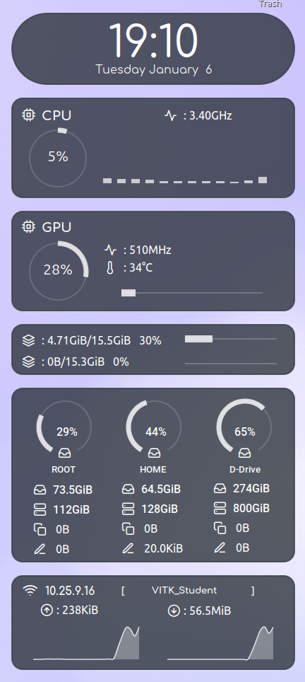

# Conky Themes For Linux

A collection of elegant Conky themes with both light and dark variants.

## Preview

<table>
<tr>
<td width="50%">

### Vistar Light Theme


</td>
<td width="50%">

### Vistar Dark Theme



</td>
</tr>
</table>

## Features

- ✨ Clean and modern design
- 🎨 Light and dark variants
- 📊 System monitoring (CPU, RAM, Network, Disk usage)
- 🎯 Lightweight and customizable
- 🚀 Easy installation and setup

## Requirements

### Debian-based Distros (Ubuntu, Linux Mint, Zorin, etc.)

```bash
sudo apt install conky-all
```

### Arch-based Distros

```bash
sudo pacman -S conky
```

### Fedora

```bash
sudo dnf install conky
```

## Installation

1. **Clone or download this repository**

   ```bash
   git clone <repository-url>
   cd Conky-Themes
   ```

2. **Create the Conky configuration directory** (if it doesn't exist)

   ```bash
   mkdir -p ~/.config/conky
   ```

3. **Copy the theme to your config directory**

   For the dark theme:
   ```bash
   cp -r vistar-dark ~/.config/conky/
   ```

   For the light theme:
   ```bash
   cp -r vistar-light ~/.config/conky/
   ```

4. **Make the startup script executable**

   ```bash
   chmod +x ~/.config/conky/vistar-dark/conky.sh
   # or for light theme
   chmod +x ~/.config/conky/vistar-light/conky.sh
   ```

5. **Run Conky manually**

   ```bash
   ~/.config/conky/vistar-dark/conky.sh
   # or for light theme
   ~/.config/conky/vistar-light/conky.sh
   ```

## Autostart on Login/Startup

To automatically start Conky when you log in, create a `.desktop` file in the autostart directory.

1. **Create the autostart directory** (if it doesn't exist)

   ```bash
   mkdir -p ~/.config/autostart
   ```

2. **Create the desktop entry file**

   For **Vistar Dark Theme**:
   ```bash
   nano ~/.config/autostart/conky-vistar-dark.desktop
   ```

   Add the following content:
   ```ini
   [Desktop Entry]
   Type=Application
   Exec=/home/$USER/.config/conky/vistar-dark/conky.sh
   X-GNOME-Autostart-enabled=true
   NoDisplay=false
   Hidden=false
   Name=Conky Vistar Dark
   Comment=System monitor widget - Vistar Dark Theme
   X-GNOME-Autostart-Delay=0
   ```

   For **Vistar Light Theme**:
   ```bash
   nano ~/.config/autostart/conky-vistar-light.desktop
   ```

   Add the following content:
   ```ini
   [Desktop Entry]
   Type=Application
   Exec=/home/$USER/.config/conky/vistar-light/conky.sh
   X-GNOME-Autostart-enabled=true
   NoDisplay=false
   Hidden=false
   Name=Conky Vistar Light
   Comment=System monitor widget - Vistar Light Theme
   X-GNOME-Autostart-Delay=0
   ```

3. **Make the desktop file executable**

   ```bash
   chmod +x ~/.config/autostart/conky-vistar-dark.desktop
   # or for light theme
   chmod +x ~/.config/autostart/conky-vistar-light.desktop
   ```

> **Note:** Replace `$USER` with your actual username, or use the full path like `/home/yourusername/.config/conky/vistar-dark/conky.sh`

### About the .desktop File

The provided `.desktop` file structure is mostly correct, with the following improvements:
- ✅ `Type=Application` - Correct
- ✅ `Exec` path - Correct (use full path recommended)
- ✅ `X-GNOME-Autostart-enabled=true` - Enables autostart
- ✅ `NoDisplay=false` - Makes it visible in startup applications
- ✅ `Hidden=false` - Ensures it's not hidden
- ⚠️ `Name[en_IN]=conky` - Changed to `Name=Conky Vistar Dark` for better compatibility
- ⚠️ `Comment[en_IN]=conky` - Changed to descriptive comment without locale
- ✅ `X-GNOME-Autostart-Delay=0` - Starts immediately on login

## Theme Structure

Each theme folder contains:
- `conky.sh` - Startup script that kills existing Conky instances and launches the theme
- `config/` - Configuration files
  - `conky.conf` - Main Conky configuration file
  - `conky_draw.lua` - Lua script for drawing graphics
  - `conky_draw_config.lua` - Configuration for graphical elements
- `fonts/` - Custom fonts used by the theme

## Customization

### Modifying the Theme

You can customize various aspects of the theme by editing the configuration files:

1. **Edit display position and appearance:**
   
   Edit the main configuration file:
   ```bash
   nano ~/.config/conky/vistar-dark/config/conky.conf
   ```

2. **Customize graphical elements (rings, bars, etc.):**
   
   Edit the drawing configuration:
   ```bash
   nano ~/.config/conky/vistar-dark/config/conky_draw_config.lua
   ```

3. **Change colors, transparency, and fonts:**
   
   Modify values in both `conky.conf` and `conky_draw_config.lua`

### Common Customization Options

In `conky.conf`, you can adjust:
- `alignment` - Position on screen (top_left, top_right, bottom_left, etc.)
- `gap_x` and `gap_y` - Distance from screen edge
- `own_window_transparent` - Transparency settings
- `own_window_argb_value` - Opacity level (0-255)
- `font` - Default font family and size

## Additional Resources

For further customization and advanced configuration, refer to:

- [Conky Variables Documentation](https://conky.sourceforge.net/variables.html)
- [Conky Configuration Settings](https://conky.sourceforge.net/config_settings.html)
- [Conky Draw - Graphics Library](https://github.com/fisadev/conky-draw)

## Troubleshooting

### Conky doesn't start
- Ensure the script has execute permissions: `chmod +x ~/.config/conky/vistar-dark/conky.sh`
- Check if Conky is installed: `which conky`
- Run the script manually to see error messages: `~/.config/conky/vistar-dark/conky.sh`

### Conky appears in wrong position
- Edit the `alignment`, `gap_x`, and `gap_y` values in `conky.conf`
- Restart Conky after making changes

### Fonts not displaying correctly
- Ensure custom fonts are properly installed or modify the font settings in `conky.conf`
- Install missing fonts from the `fonts/` directory

### Autostart not working
- Verify the path in the `.desktop` file is correct and absolute
- Check desktop environment compatibility (works best with GNOME, KDE, XFCE, Cinnamon)
- Check if the desktop file has execute permissions
- Look for errors in `~/.xsession-errors` log file

### Multiple Conky instances running
- The `conky.sh` script automatically kills existing instances with `killall conky`
- If issues persist, manually kill processes: `killall -9 conky`

## Switching Between Themes

To switch from one theme to another:

1. Stop the current Conky:
   ```bash
   killall conky
   ```

2. Start the desired theme:
   ```bash
   ~/.config/conky/vistar-light/conky.sh
   # or
   ~/.config/conky/vistar-dark/conky.sh
   ```

3. Update the autostart desktop file to point to the new theme if you want it to persist after reboot.

## License

See [LICENSE](LICENSE) file for details.

---
